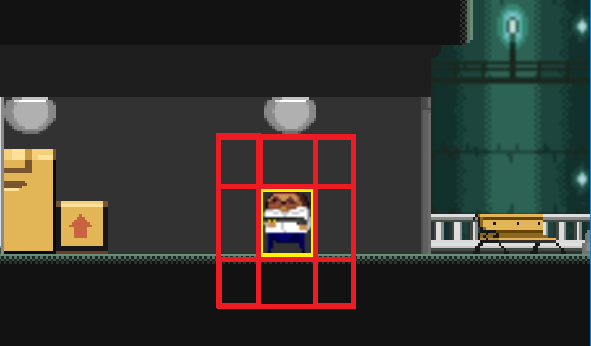
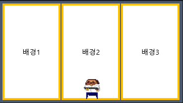
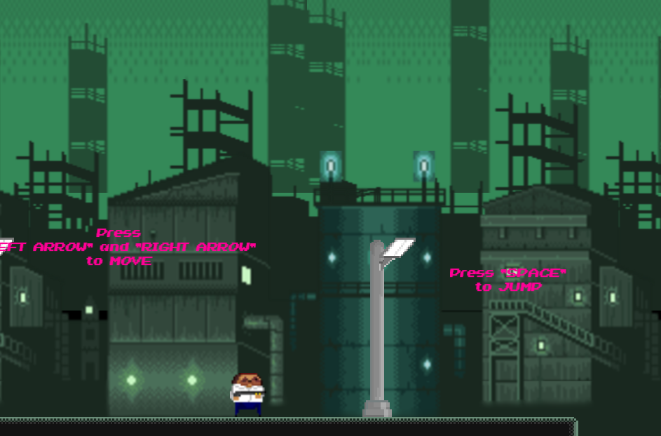
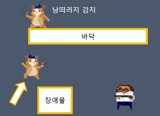
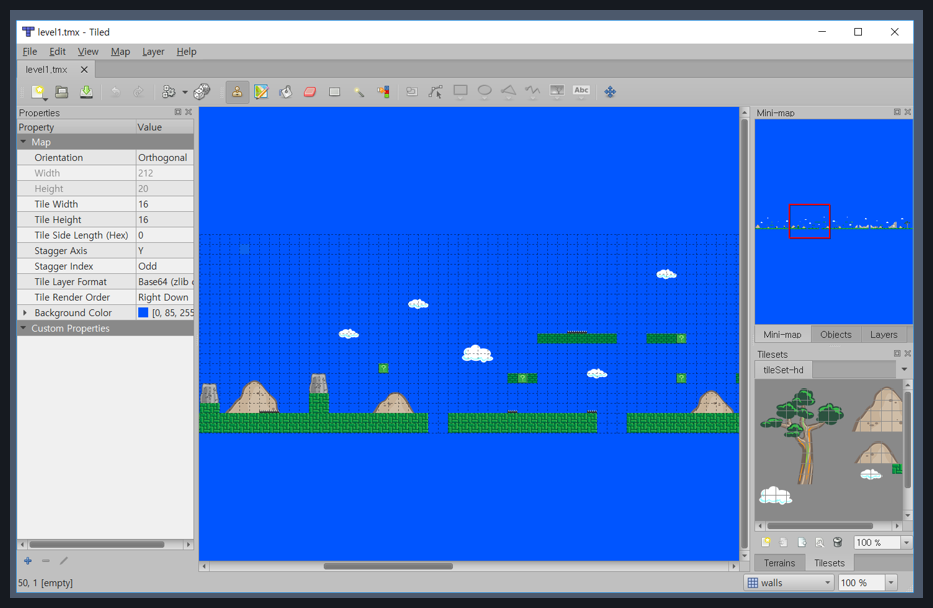
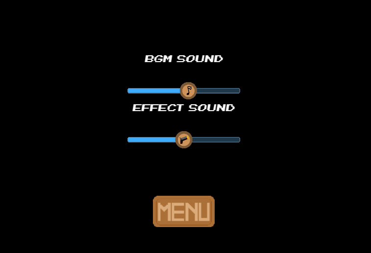
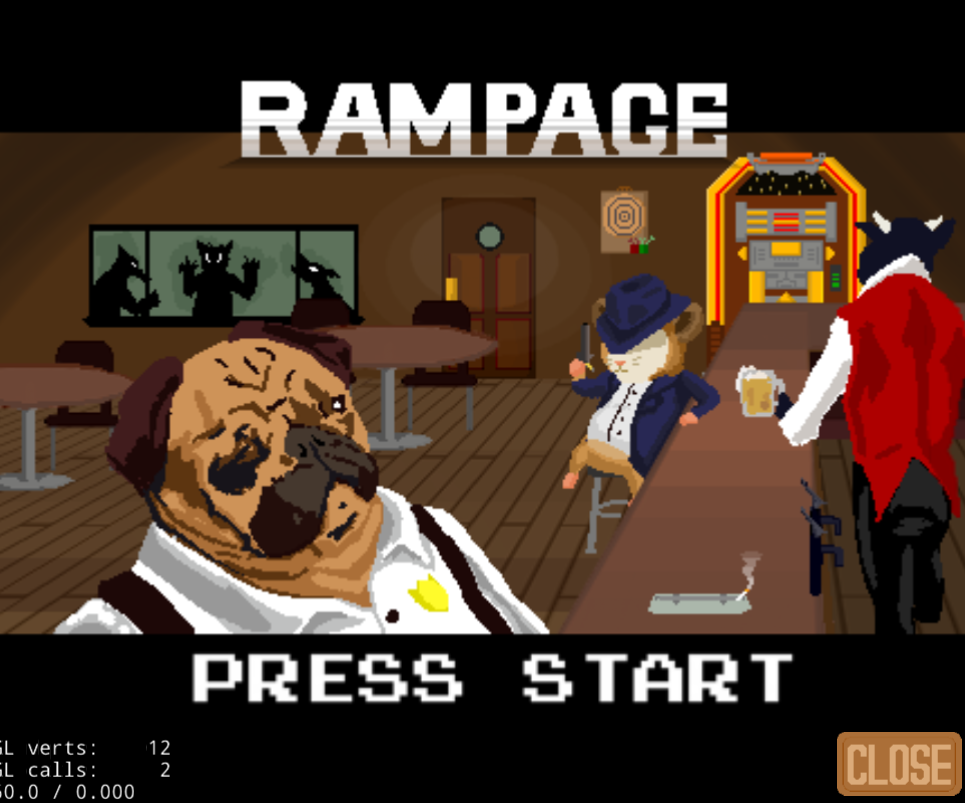
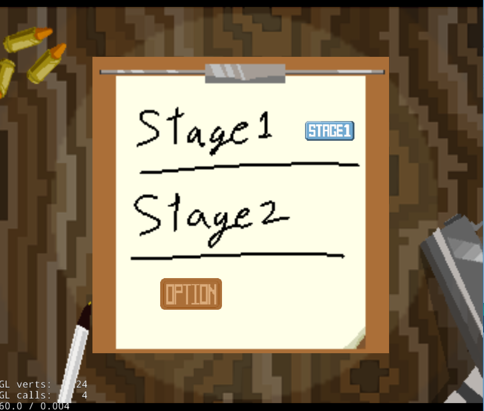

# RAMPAGE
********************************************************************************************************
<article>
#Project Member : 1 Game Deginer 
#Language : C++ 
#Platform : PC 
#Date : 2017/06/27~2017/12/07 
#Cocos-2DX 사이드 스크롤 액션 게임 
#File Link : https://drive.google.com/file/d/16wb_AB1fLR4Fc4RQ-v-EOcZmN5JaAiWN/view?usp=sharing 
</article> 

<body>
  <h1>요약</h1>
  

    

      *File Link를 통해 받은 Bin.zip파일을 풀어 RAMPAGE.exe로 실행* 
      Cocos-2DX를 활용한 사이드 스크롤 게임입니다. 당시 2D게임에 대한 로망과 함께 유니티라는 엔진의 틀을 벗어나 보고 싶었고 Cocos를 접하게 되면서 학기 중이라도 짧게나마 정성을 들여 만들 수 있는 가장 정통적인 사이드 스크롤 2D게임을 프로토타입이라도 제작해보고 싶었습니다. 
    

  

  
  <h1>주요 제작 요소</h1>
  

    <ol>
      <li><b>캐릭터 이동/중력/충돌판정</b> 
      - 각 캐릭터마다 객체의 8방향(전/후/좌/우/4방향 대각방향)을 순차적으로 확인하여 캐릭터의 상태를 변경 
      - 키보드 입력에 따른 캐릭터 이동과 애니메이션 구현 
      - 카메라가 부드럽게 캐릭터를 따라가도록 구현 
       
       
      *이동 및 점프, 중력, 타일충돌 적용
      </li>
       
      <li><b>패럴렉스 배경 생성</b> 
      - 배열과 배경의 크기, 카메라의 위치에 따라 변경되는 패럴렉스 배경 생성 
       
      </li>
       
      <li><b>적 AI 생성</b> 
      - 플레이어의 위치를 읽고 범위 안이면 추격 
      - 플레이어가 범위에 없으면 ‘수색’모드로 돌입 
      - ‘수색’모드 중 낭떠러지에 떨어지지 않음  
      - 단, 플레이어가 있으면 낭떠러지도 추격 
      - 플레이어가 범위에 있을 때, 전방에 장애물이 존재하면 점프 
       
      </li>
       
      <li><b>타일맵 생성</b> 
      - Tiled프록그램을 활용한 타일맵 생성 이후 코코스에 사용 
       
      </li>
       
      <li><b>옵션을 통한 사운드 컨트롤</b> 
      - 옵션을 통한 게임 사운드 및 BGM 사운드 조절 
       
      </li>
       
      <li><b>각종 게임 씬 제작</b> 
      - 게임 타이틀/메인메뉴/옵션/게임 오버 화면 등을 제작 및 배치 
      - 각 씬에 필요한 버튼 배치 및 다른 씬과의 연동  
       
      </li>
       
      <li><b>사이툴을 통한 그래픽 제작</b> 
      - 게임 내부에 사용되는 배경을 제외한 모든(타일 포함) 그래픽 자체 제작 
      </li>
    </ol>
  

  <h2>짧은 게임 GIF</h2>
   
</body>
